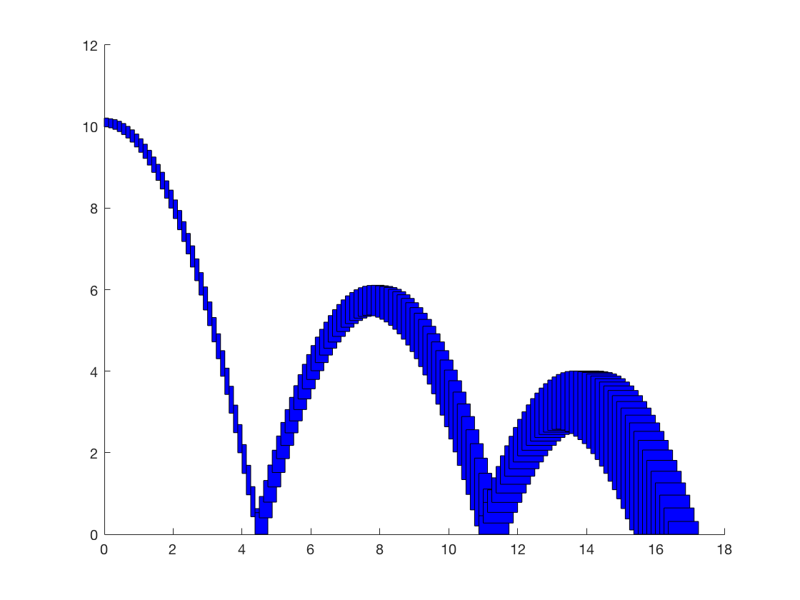
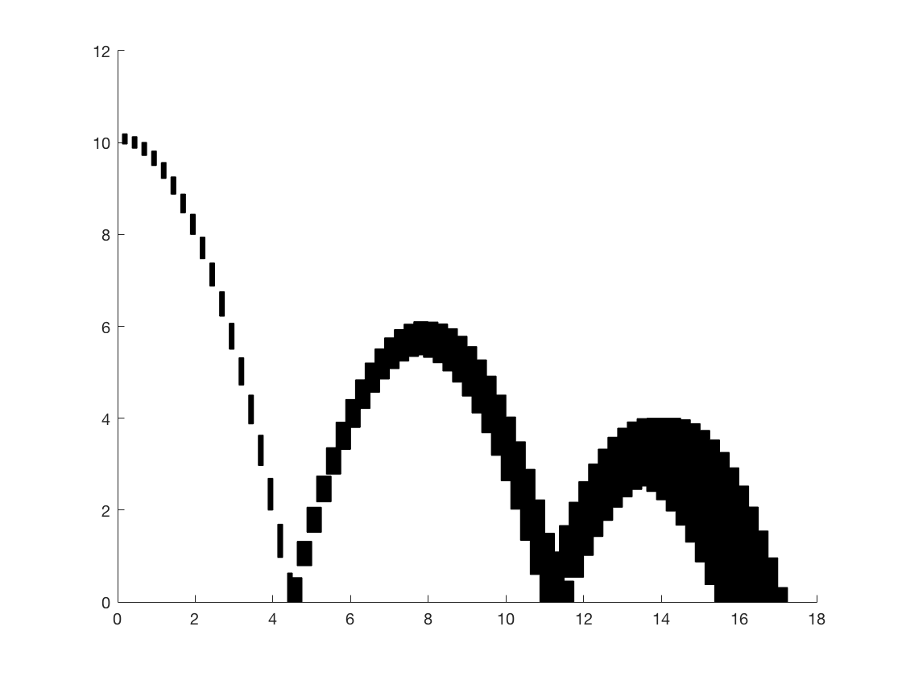
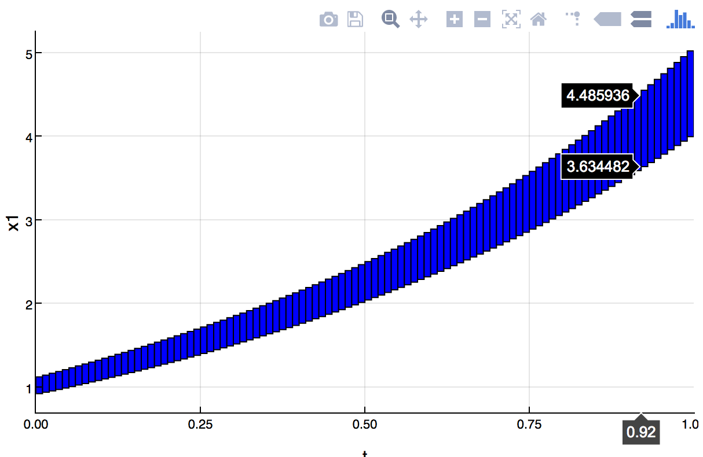
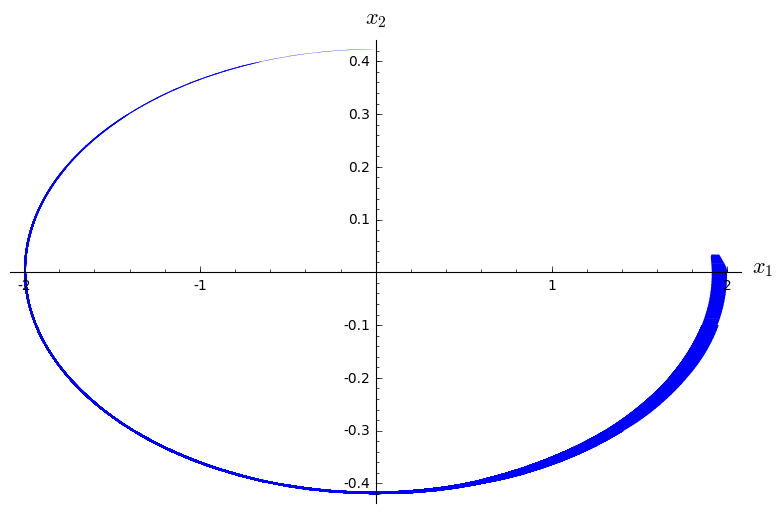

# Plotting

There are different options to visualize SpaceEx results. Here we present some
alternatives. An illustrative example is presented in
[Example](https://nikos-kekatos.github.io/SpaceEx-tutorials/example/).

## `plot_2d_vertices.m` (Matlab)

There is a default script that can be downloaded from SpaceEx webpage,
[plot\_2d\_vertices.m](http://spaceex.imag.fr/sites/default/files/downloads/plot_2d_vertices.m). For the timed bouncing ball, we get 

A [revised script](https://github.com/nikos-kekatos/SpaceEx-tutorials/tree/master/Files/Plotting/MATLAB/src) with extra options (save, set animations, verbosity, ranges, polytope numbers, reduced computation time) is also available. Assume that we do not want the entire flowpipe (all the polytopes). We can only plot half of it (evenly distributed) by running [template\_plotting\_bball](https://github.com/nikos-kekatos/SpaceEx-tutorials/blob/master/Files/Plotting/MATLAB/examples/Bouncing_Ball/plotting_template_bball.m).

Authors: Nikolaos Kekatos, Marcelo Forets.

## `LazySets.jl` (Julia)

[LazySets.jl](https://github.com/juliareach/LazySets.jl) is part of [JuliaReach](https://github.com/juliareach), an online
organization that develops tools for reachability computations of dynamical systems in [Julia](https://julialang.org/).

This is the more feature-rich alternative, since there are many plotting backends
available. The following example was obtained with the `Plotly` backend.

Link: [LazySets.jl](https://juliareach.github.io/LazySets.jl/latest/)

Authors: Marcelo Forets, Christian Schilling, Frédéric Viry.

## `plot_2d_vertices.py` (Python/SageMath)

This is a [Python script](https://github.com/nikos-kekatos/SpaceEx-tutorials/blob/master/Files/Plotting/Sage/plot_polygons_sage.ipynb) that sequentially reads the polygons as polyhedra objects
through SageMath, plots them in the same pair of axes. For the pendulum example, we use the simple [Python script](https://github.com/nikos-kekatos/SpaceEx-tutorials/blob/master/Files/Plotting/Sage/Example/plot_polygons_sage.ipynb).

Author: Marcelo Forets.

## Bash script

This solution is needs the tools: `graph` and `pdftoppm` added to your path.
Also `spaceex` should be accessible from your path. The script works by transforming
the SpaceEx result to PDF and to PNG formats. 

Link: [plot_gen.sh](https://github.com/JuliaReach/ReachabilityBenchmarks/blob/master/models/SLICOT/iss/spaceex.sh). 

Author: Christian Schilling. 

## `3PLIB` (Java)

The project [3PLIB](https://3plib.wordpress.com/) is a Java Library specialized
to planar projections of convex polyhedra. It was initially created to embed this feature
in Java applications, and also provides a backend for visualization of high-dimensional
reach set approximations computed with [SpaceEx](http://spaceex.imag.fr/).

Link: [3PLIB](https://3plib.wordpress.com/)

Author: Frédéric Viry.

